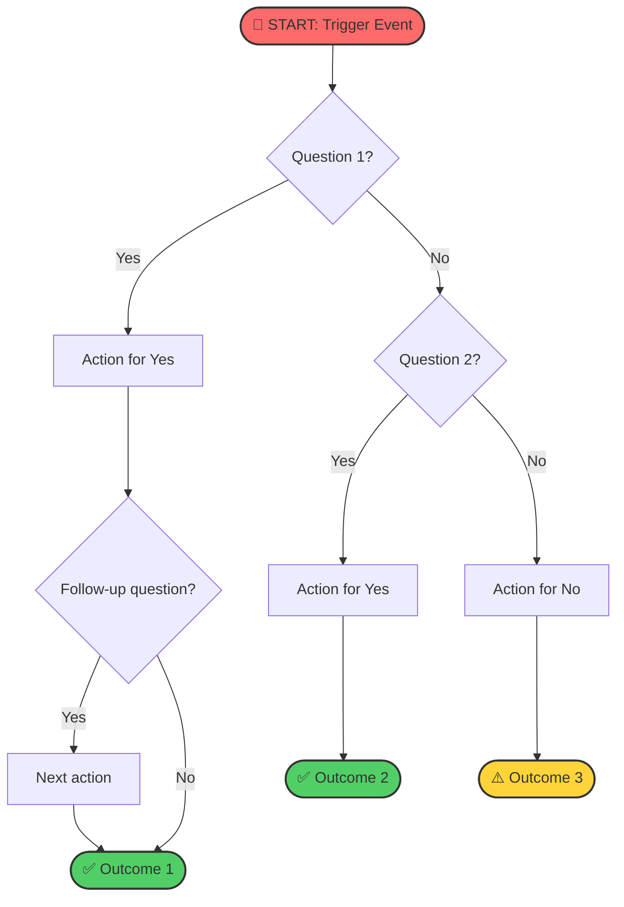

# Decision Flowchart: [SCENARIO NAME]

**Version**: 1.0
**Created**: [DATE]
**Last Updated**: [DATE]
**Related SOP**: [sop-filename.md]

---

## Quick Reference

| | |
|---|---|
| **START when** | [Trigger condition] |
| **Goal** | [What decision we're making] |
| **Time to complete** | [Expected time through flowchart] |

---

## Flowchart



---

## Decision Criteria

### Q1: [Full question text]?

**Answer YES if**:
- [Condition 1]
- [Condition 2]

**Answer NO if**:
- [Condition 1]
- [Condition 2]

**If unsure**: [Default guidance]

---

### Q2: [Full question text]?

**Answer YES if**:
- [Condition 1]
- [Condition 2]

**Answer NO if**:
- [Condition 1]
- [Condition 2]

**If unsure**: [Default guidance]

---

### Q3: [Full question text]?

**Answer YES if**:
- [Condition 1]
- [Condition 2]

**Answer NO if**:
- [Condition 1]
- [Condition 2]

**If unsure**: [Default guidance]

---

## Action Details

### A1: [Action name]
[Brief description of what to do]

**Time required**: [Estimate]
**Resources needed**: [List]
**See also**: [Related document/section]

---

### A2: [Action name]
[Brief description of what to do]

**Time required**: [Estimate]
**Resources needed**: [List]
**See also**: [Related document/section]

---

### A3: [Action name]
[Brief description of what to do]

**Time required**: [Estimate]
**Resources needed**: [List]
**See also**: [Related document/section]

---

### A4: [Action name]
[Brief description of what to do]

**Time required**: [Estimate]
**Resources needed**: [List]
**See also**: [Related document/section]

---

## Outcomes

### END1: [Outcome name]
**What this means**: [Explanation]
**Next steps**: [What to do after]

### END2: [Outcome name]
**What this means**: [Explanation]
**Next steps**: [What to do after]

### END3: [Outcome name]
**What this means**: [Explanation]
**Next steps**: [What to do after]

---

## Quick Reference Card

> **Print this section on an index card**

```
[SCENARIO] DECISION GUIDE

1. [First question] → Yes: [action] / No: continue
2. [Second question] → Yes: [action] / No: [action]
3. [Third question] → Yes: [action] / No: [action]

REMEMBER:
• [Key point 1]
• [Key point 2]
• [Key point 3]

CONTACTS:
• [Contact 1]: [Number]
• [Contact 2]: [Number]
```

---

## Notes

[Any additional context, exceptions, or special circumstances]

---

*Document generated by Claude Preparedness Planner*
*Review schedule: Annual*
*Print recommended: Yes - include flowchart and quick reference card*
